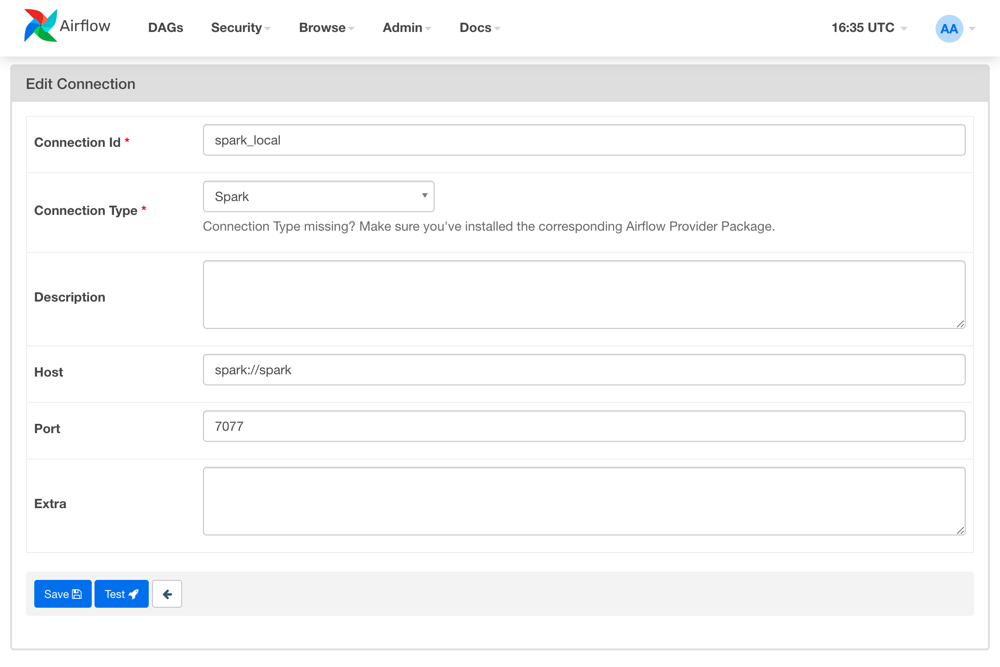

# Summary

Sample repo used to explore the usage of Open Lineage together with Spark Jobs.
Spark jobs are being orchestrated by Airflow, and OpenLineage data can be visualized using Marquez.

# Python local Setup
Setup local `.venv`

```bash 
python3 -m venv .venv
pip install -r requirements.txt
```

# Infra Setup
```bash
# Move to infra dir
cd infra
```
Create an `.env` file based on what you see in `.env.example` to set your `minio` credentials

After that's done, you will need to build all the images and deploy it in containers using `docker-compose`

```bash
# Build Airflow Image 
docker build -f ./images/Dockerfile.Airflow . -t airflow-spark
# Build Spark Image 
docker build -f ./images/Dockerfile.Spark . -t spark-local

# Create the containers for all infra components
docker-compose up -f docker-compose.Storage.yml up -d
docker-compose up -f docker-compose.Spark.yml up -d
docker-compose up -f docker-compose.Airflow.yml up -d
```
# Services
Once the setup is completed, you can access the following services:
- `airflow`: `localhost:8080`
- `spark-master`: `localhost:8090`
- `minio`: `localhost:9001`
- `marquez`: `localhost:3000`

# Create Spark Connection in Airflow
In order for Airflow to be able to submit jobs to the Spark Cluster, a connection needs to be setup.


# Exploration
If you want to interact with Spark and OpenLineage in a more developer friendly way, a Jupyter Notebook service is also provided.

Access the `notebook` service logs, deployed by `docker-compose.Storage.yml`, and you will find a a link similar to this, `http://127.0.0.1:8888/?token=XXXXXX`that will give you access to a Jupyter Notebook. Some notebooks, created during the DAG development are readily available.

# Orchestration

Access the Airflow webserver, and start the `ETL` DAG, wait a couple of minutes (you can monitor the Spark job in `localhost:8090`). 

After the DAG is completed, access the Marquez WebApp (`localhost:3000`) to check the lineage data that the Spark Jobs have created.